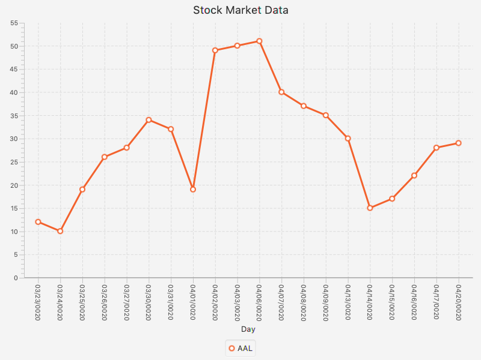
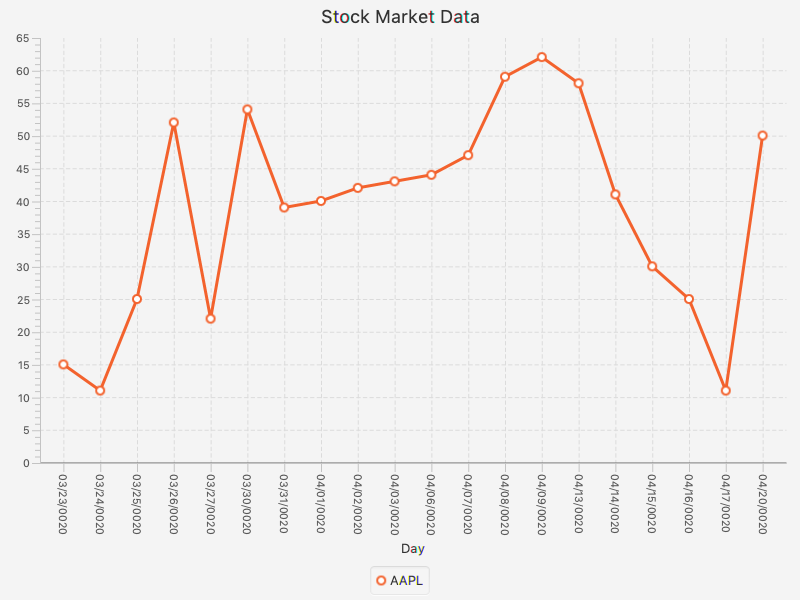
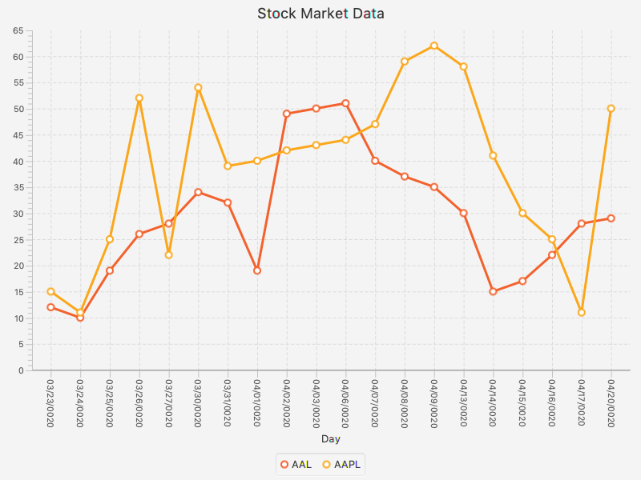
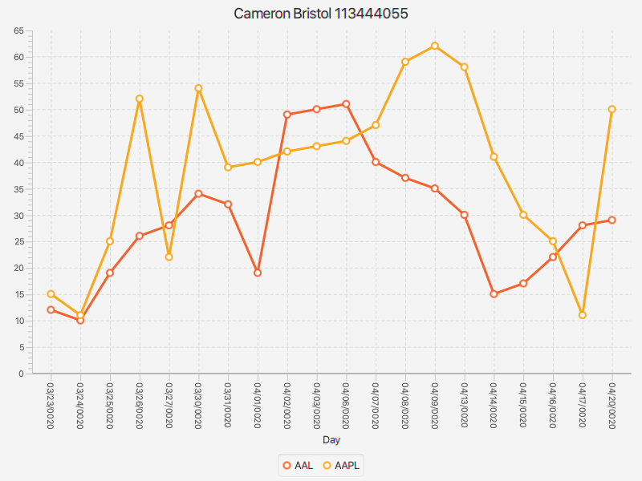

# Lab 12

Welcome to Lab 12. 
We will be working with JavaFX in this lab. 
Please refer to the Project 3 README for instructions on installing JavaFX. 
This lab will demonstrate how to read data from a file and use it to create a LineChart in JavaFX to display the data. 
Specifically, we will be looking at the stock market data of Apple and American Airlines.
Please refer to the Project 3 example source file for details on creating LineCharts.

**Refer to the documenation provided in the code on method implementations and complete all of the required TODO's in StockMarket and DataAnalyzer classes respectively.**

**Submission instructions** 
1) Commit your code to this repo as you go.
2) Set the title of your LineChart to be your name and OU ID number.
2) Add an image of your LineChart to this README file.

**How to post an image in a GitHub README**
1) Upload your image to this repo.
2) In this README file, use the syntax ``, where "alt text" is what is displayed if your image is not found and "image.jpg" is the name of your image file.

**Here is the American Airlines data plotted only**

**Here is the Apple data plotted only**

**Here is how your final LineChart should appear**

**Here is how my file looks**

